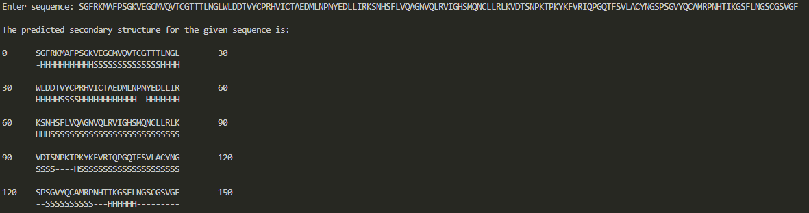

# Chou-Fasman Algorithm

The Chou-Fasman algorithm is a computational method used for predicting protein secondary structure. It was developed by Chou and Fasman in the late 1970s and is based on statistical analysis of known protein structures.

The algorithm operates by assigning a propensity score to each amino acid in a protein sequence, indicating the likelihood of that amino acid adopting a particular secondary structure (alpha helix, beta strand, or coil). These propensity scores are derived from the analysis of protein structure databases.

My implementation considers only alpha helices (denoted by 'H') and beta strands (denoted by 'S'). The parameters used for prediction are:

| Protein   | Propensity (H) | Propensity (S) |
|-----------|-------------------|-------------------|
| Glutamate | 1.53              | 0.26              |
| Alanine   | 1.45              | 0.97              |
| Leucine   | 1.34              | 1.22              |
| Histidine | 1.24              | 0.71              |
| Methionine | 1.20             | 1.67              |
| Glutamine | 1.17              | 1.23              |
| Tryptophan | 1.14             | 1.19              |
| Valine    | 1.14              | 1.65              |
| Phenylalanine | 1.12         | 1.28              |
| Lysine    | 1.07              | 0.74              |
| Isoleucine | 1.00             | 1.60              |
| Aspartate | 0.98              | 0.80              |
| Threonine | 0.82              | 1.20              |
| Serine    | 0.79              | 0.72              |
| Arginine  | 0.79              | 0.90              |
| Cysteine  | 0.77              | 1.30              |
| Asparagine | 0.73             | 0.65              |
| Tyrosine  | 0.61              | 1.29              |
| Proline   | 0.59              | 0.62              |
| Glycine   | 0.53              | 0.81              |

## Screenshot

